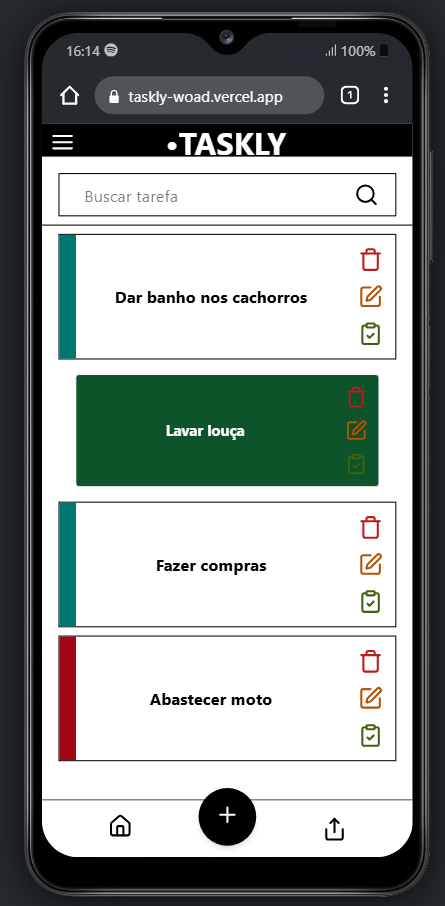
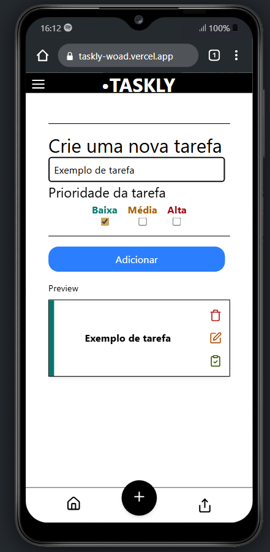
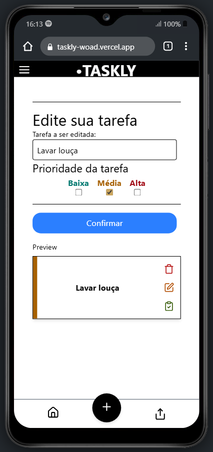
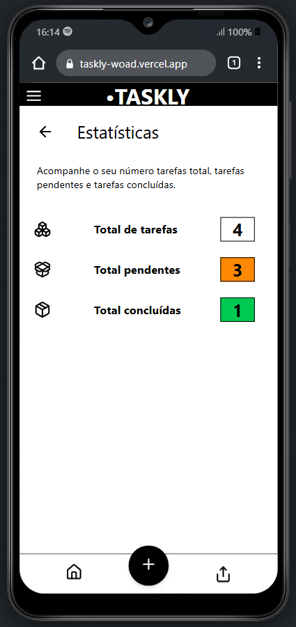

# 📋 Taskly - Gerenciador de Tarefas com Autenticação

Taskly é uma aplicação web full stack para gerenciamento de tarefas com autenticação de usuários. Permite criar, editar, filtrar, marcar como concluídas e deletar tarefas, com estatísticas em tempo real e design responsivo.

---

## 🖼️ Imagens do Projeto

> Interface de Gerenciamento de Tarefas:







## 🚀 Funcionalidades

- Registro e login de usuários com autenticação protegida
- CRUD completo de tarefas (criar, listar, editar, deletar)
- Marcar/desmarcar tarefas como concluídas
- Filtro de busca por nome da tarefa
- Estatísticas com total, feitas e pendentes
- Toast de feedback para ações e erros
- Layout responsivo para desktop e mobile

---

## 🧪 Tecnologias Utilizadas

### Frontend

- React
- React Router DOM
- Tailwind CSS
- Vite
- Toastify

### Backend

- Node.js
- Express
- MongoDB
- CORS
- JWT para autenticação

---

## 💻 Como rodar localmente

1. Clone este repositório

```bash
git clone https://github.com/LuisFPamplona/taskly.git
cd taskly
```

2. Instale as dependências

```bash
# Frontend
cd client
npm install

# Backend
cd ../server
npm install
```

3. Inicie o backend e frontend

```bash
# Backend
npm run dev

# Frontend
cd ../client
npm run dev
```

---

## 🌐 Deploy

- Frontend: https://taskly-woad.vercel.app/
- Backend: https://taskly-1x39.onrender.com

---

## 📚 Aprendizados

Esse projeto foi desenvolvido para praticar os fundamentos de uma aplicação full stack com autenticação, integração frontend-backend e controle completo de dados. Foram aplicadas boas práticas de UX, responsividade, organização de código e uso de hooks do React, entre outros.

---

## 📬 Contato

Feito por **Luis Pamplona**  
[GitHub](https://github.com/LuisFPamplona) | [LinkedIn](https://linkedin.com/in/luis-pamplona-552030310)
